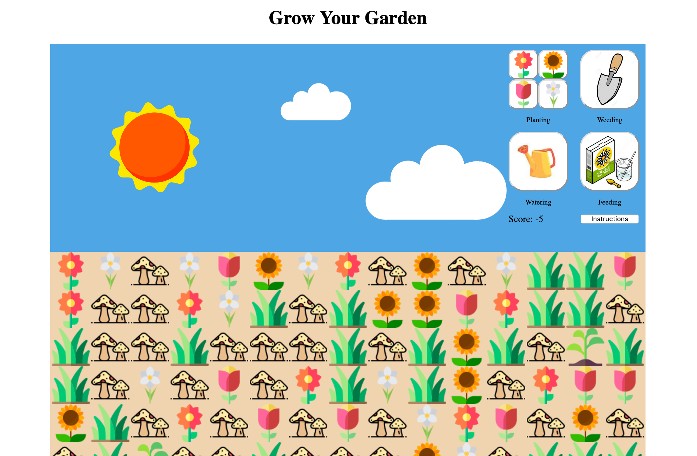

# Grow-Your-Garden-game



## What is Grow Your Garden?

It is a game that you have to weed as fast as you could while cultivate your garden plot to contain more flowers than weeds. If the plot has more weeds than flowers, the player lose. 

## Technical Discussion

HTML, CSS, JavaScript

> List of the technologies you're using (HTML, CSS, JavaScript)

### Notes on Game Structure
```Javascript
const weedIncrease = setInterval(() => {
    weedGrowth()
    const playerScore = person.keepScore(numberOfWeed)
    document.getElementById("score").innerText = "Score: " + playerScore
    if (document.querySelector(".emptyDiv") === null) {
        if (allPlants.length > numberOfWeed) {
            alert ("Congrats! You have successfully made a garden!")
        } else if (allPlants.length < numberOfWeed) {
            alert ("Your garden has been flooded by weeds. But You can collect your mushrooms for dinner!")
        } else if (allPlants.lenth === numberOfWeed) {
            alert ("You half-assed it! Try again?")
        }
        document.querySelector(".mask").style.display = "flex"
        clearInterval(weedIncrease)
    }
}, 1000)
```
The biggest challenge is thinking of a way, a loop to thread the game together, a function that could be used to keep "time". As the game evolve, I have decided to change it from a simple pet plant game where you race against the growing weeds. The setInterval function in this case came in as the main thread that keeps the other functions of growing flowers (i.e. watering, feeding) together. 

> Code samples, description of challenges you overcame, etc.

## The Making of [Your Game]

Resources used: 
Icons made by <a href="https://www.flaticon.com/authors/freepik">Freepik from www.flaticon.com
Icons made by <a href="https://www.flaticon.com/authors/nikita-golubev">Nikita Golubev from www.flaticon.com
Icons made by <a href="https://www.flaticon.com/authors/mynamepong">mynamepong from www.flaticon.com
Lottie Player

Dexter has been really helpful through the making of the game. :) 

> Any credits or notes you feel you should add

## Opportunities for Future Growth

> If you had more time to work on your game, what would you do?

- Add some animation for watering and feeding features.
- Make it so that a player can end the game without all sprouts are grown. 


